# 22 câu hỏi và đáp án ôn thi Kiến trúc phần mềm

- **Đề gốc:** [PDF 22 câu hỏi vấn đáp](materials/22-cau-hoi-thi-kien-truc-phan-mem.pdf) — GV. TS. Ngô Huy Biên, 2026.
- Mỗi câu gồm **đề bài rút gọn** và **đáp án cốt lõi** ngay bên dưới.
- Nội dung chỉ giữ các ý vừa đủ để trả lời đúng câu hỏi.

## Kiến thức chung

- **Khái niệm:** trả lời WHAT → HOW → WHY → WHEN.
- **Logic view:** chức năng/trách nhiệm → quan hệ → công nghệ/ngôn ngữ của từng thành phần.
- **Deployment view:** node phần cứng/phần mềm → artifact/module → giao thức kết nối.
- **Process view:** các process chạy lúc runtime → input/biến đổi/output → IPC/giao thức → concurrency nếu có.
- **Quality:** mỗi đặc tính đi cùng công cụ, cách kiểm tra và metric.
- **Bằng chứng:** chỉ nói điều đã thực hành; nộp đúng bản in giao diện/câu lệnh liên quan.
- **Thời gian:** 10 phút viết A4 không dùng tài liệu → 2 phút chọn bản in → 5–10 phút vấn đáp.
- **Chấm điểm:** giấy A4 trống/không liên quan là 0; trả lời thiếu hoặc thiếu bản in tối đa 8; đủ ý và đúng bản in được trên 8–10 điểm.

---

# Topic 1 — Microservices (câu 1–5)

**Lý thuyết chung:** hệ thống được chia thành các service có trách nhiệm riêng. Service giao tiếp qua mạng, có thể deploy/scale độc lập nhưng cần xử lý lỗi mạng, dữ liệu phân tán và observability.

## Câu 1 — Microservices: chất lượng và triển khai

### Đề bài rút gọn

- Liệt kê các đặc tính chất lượng mong muốn đạt được.
- Liệt kê công cụ có thể dùng để kiểm tra các đặc tính đó.
- Trình bày các bước kiểm tra.
- Vẽ **deployment view**.
- Ghi công cụ triển khai cho từng thành phần trên sơ đồ.
- Trình bày các bước triển khai hệ thống.
- **Nộp kèm:** giao diện/câu lệnh kiểm tra chất lượng và câu lệnh triển khai.

### Đáp án cốt lõi

- **Ví dụ chung câu 1–5:** [DeathStarBench Hotel Reservation](https://github.com/delimitrou/DeathStarBench/tree/master/hotelReservation), viết bằng Go và giao tiếp nội bộ bằng gRPC.
- **Core:** chia hệ thống thành các service độc lập để deploy và scale riêng.
- **1. Performance — Công cụ:** `wrk2`; **cách đo:** p95 latency, request/giây và error rate.
- **2. Scalability — Công cụ:** `wrk2` + `kubectl scale`; **cách đo:** cùng workload trước/sau khi tăng replica.
- **3. Availability — Công cụ:** `kubectl delete pod`; **cách đo:** số request lỗi và thời gian phục hồi khi một pod chết.
- **4. Deployability — Công cụ:** Docker Compose/Kubernetes/Helm; **cách đo:** deploy từng service/container.
- **5. Security — Công cụ:** TLS + test HTTP/gRPC; **cách đo:** kết nối mã hóa hoạt động, kết nối sai cấu hình thất bại.

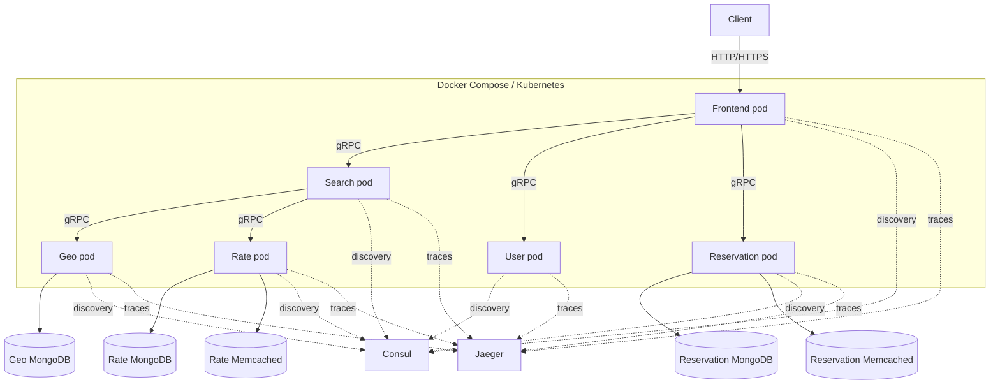

- **Công cụ triển khai:** Docker đóng gói; Compose/Kubernetes/Helm chạy services; MongoDB lưu dữ liệu; Memcached làm cache; Consul tìm service.
- **Các bước:** build image → deploy databases/Consul/Jaeger → deploy services → kiểm tra containers/pods → chạy `wrk2`.

```bash
docker compose up -d --build
docker compose ps
kubectl apply -Rf hotelReservation/kubernetes/
kubectl get pods,svc
```

- **Bản in đúng theo đề:** một số giao diện/câu lệnh dùng để kiểm tra chất lượng và một số câu lệnh triển khai. Đề **không bắt buộc** in kết quả load test.

---

## Câu 2 — Microservices: logic, giao tiếp và tiến trình

### Đề bài rút gọn

- Vẽ **logic view**.
- Ghi công cụ cài đặt từng thành phần trên sơ đồ.
- Giải thích cách các service giao tiếp với nhau.
- Vẽ **process view** cho một use case cụ thể.
- **Nộp kèm:** câu lệnh cài đặt mã nguồn hệ thống.

### Đáp án cốt lõi

- **Core:** logic view cho biết service nào làm gì; process view cho biết các process runtime xử lý và truyền dữ liệu thế nào.

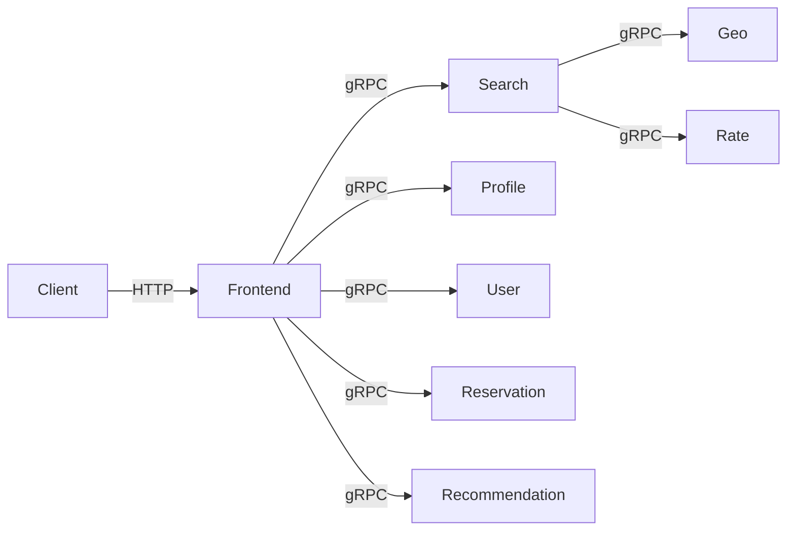

- **Công cụ:** Go cho services; protobuf định nghĩa interface; gRPC truyền request/response; Consul tìm địa chỉ và cân bằng giữa instances.
- **Giao tiếp:** Frontend nhận HTTP rồi gọi đồng bộ các service bằng gRPC.

**Process view: đặt phòng**

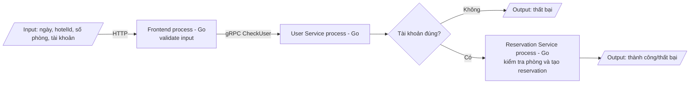

- **Input:** ngày, hotel ID, số phòng và tài khoản. **Output:** đặt phòng thành công/thất bại.
- **Bản in đúng theo đề:** một số câu lệnh cần thiết để cài đặt mã nguồn.

---

## Câu 3 — Microservices: bảo mật và mở rộng

### Đề bài rút gọn

- Vẽ **security view**.
- Ghi công cụ dùng để cài đặt bảo mật cho từng thành phần.
- Vẽ **scalability view**.
- Ghi công cụ dùng để mở rộng từng thành phần.
- **Nộp kèm:** câu lệnh thiết lập khả năng mở rộng và câu lệnh thực hiện scale hệ thống.

### Đáp án cốt lõi

**Security view**

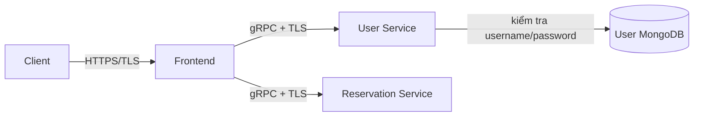

- Biến `TLS` bật mã hóa HTTP và gRPC. User Service thực hiện authentication cơ bản.
- Hệ production nên bổ sung token và authorization; không khẳng định repo đã có nếu chưa cài.

**Scalability view**

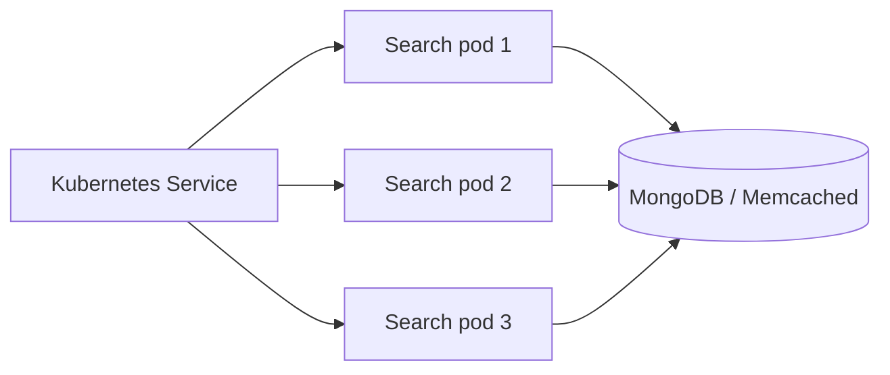

- **Công cụ/cách làm:** `wrk2` tạo tải → `kubectl scale` tăng replica → chạy lại cùng workload → so latency/throughput.

```bash
TLS=1 docker compose up -d
kubectl scale deployment hotel-reserv-search --replicas=3
```

- **Bản in đúng theo đề:** các câu lệnh thiết lập và thực hiện scaling; đề không yêu cầu in benchmark sau khi scale.

---

## Câu 4 — Microservices: logging và tracing

### Đề bài rút gọn

- Vẽ **observability view** gồm logging và tracing.
- Ghi công cụ cài đặt từng thành phần giám sát trên sơ đồ.
- **Nộp kèm:** câu lệnh xem kết quả giám sát và giao diện kết quả thu được.

### Đáp án cốt lõi

- **Core:** log mô tả việc xảy ra trong một service; trace nối toàn bộ đường đi của một request.

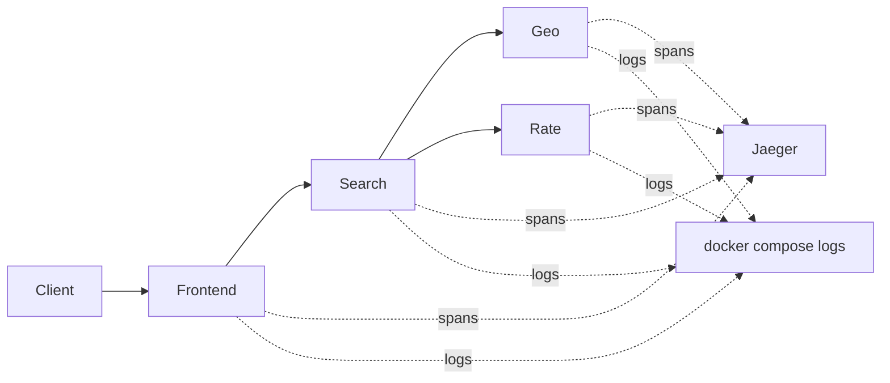

- **Công cụ:** OpenTracing gRPC interceptors tạo spans; Jaeger lưu/hiển thị trace; service logger tạo logs.
- **Cách làm:** đặt `JAEGER_SAMPLE_RATIO` và `LOG_LEVEL` → gửi search request → mở Jaeger xem Frontend → Search → Geo/Rate → đối chiếu service logs.
- **Không log:** password, token và dữ liệu nhạy cảm.
- **Bản in:** `docker compose logs <service>` và một trace trên Jaeger.

### Cách chạy demo thật cho câu 4

Demo dùng chung nằm trong thư mục `observability-demo`. Phần Microservices là `Gateway → Reservation Service`; OpenTelemetry gửi spans sang Jaeger.

```bash
cd observability-demo
docker compose up --build -d
curl http://localhost:8081/availability
docker compose logs --no-log-prefix gateway reservation
```

Mở `http://localhost:16686` → chọn `gateway-service` → **Find Traces** → mở `GET /availability`. Bản in cần lấy: câu lệnh trên và ảnh trace có `gateway-service → reservation-service`.

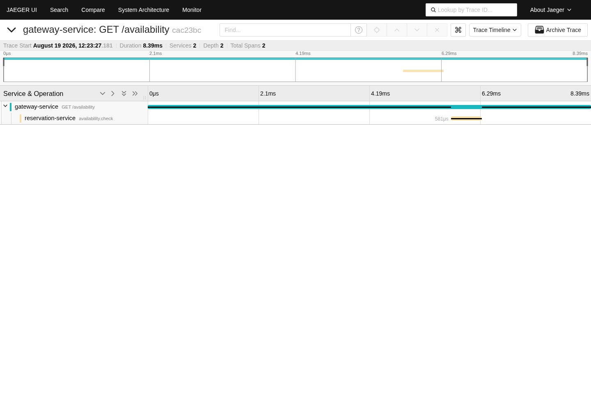

---

## Câu 5 — Microservices: phát triển và lưu trữ

### Đề bài rút gọn

- Vẽ **development view**.
- Ghi mục đích của từng thư mục trên sơ đồ.
- Nêu một ví dụ thay đổi hoặc mở rộng hệ thống.
- Trình bày từng bước thay đổi, mở rộng và kiểm thử sao cho ít ảnh hưởng toàn bộ mã nguồn.
- Vẽ **storage view**.
- Ghi mục đích của từng thực thể lưu trữ.
- **Nộp kèm:** câu lệnh cài đặt thêm một thành phần mới.

### Đáp án cốt lõi

- **Core:** tách source và dữ liệu theo service để thay đổi một phần ít ảnh hưởng phần khác.

```text
hotelReservation/
├── services/       # source của frontend, search, geo, rate, ...
├── cmd/            # entry point khởi động service
├── dialer/         # kết nối gRPC
├── registry/       # Consul service discovery
├── tls/            # cấu hình TLS
├── tracing/        # cấu hình Jaeger
├── kubernetes/     # manifests
└── helm-chart/     # Helm deployment
```

- **Ví dụ mở rộng:** thêm Loyalty Service → định nghĩa protobuf → viết server → đăng ký Consul → thêm Compose/Kubernetes config → unit/integration/E2E test.

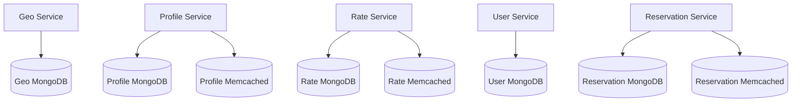

- MongoDB lưu dữ liệu bền vững; Memcached cache dữ liệu đọc thường xuyên để giảm latency.
- **Bản in đúng theo đề:** một số câu lệnh cần thiết để cài đặt thêm một thành phần mới.

---

# Topic 2 — Kiến trúc frontend (câu 6–8)

**Lý thuyết chung:** Micro-Frontend chia giao diện thành các phần được ghép bởi App Shell; JAMstack tạo sẵn HTML khi build và phân phối qua CDN, còn dữ liệu động đến từ API.

## Câu 6 — Micro-Frontends: chất lượng, logic, kết hợp và giao tiếp

### Đề bài rút gọn

- Liệt kê các đặc tính chất lượng mong muốn đạt được.
- Giải thích cách kiểm tra từng đặc tính.
- Vẽ **logic view**.
- Ghi công cụ cài đặt từng thành phần trên sơ đồ.
- Giải thích cách kết hợp các giao diện thành hệ thống hoàn chỉnh.
- Giải thích cách các giao diện giao tiếp với nhau.
- **Nộp kèm:** giao diện từng Micro-Frontend và giao diện tổng hợp.

### Đáp án cốt lõi

- **Core:** App Shell ghép các giao diện nhỏ có thể phát triển và deploy độc lập.
- **Khi dùng:** frontend lớn, nhiều nhóm cần phát hành riêng; ứng dụng nhỏ thường không cần vì tăng độ phức tạp tích hợp.
- **Trade-offs:** tăng tính tự chủ và cô lập lỗi, nhưng khó đồng bộ giao diện, dependency/version và có thể làm bundle lớn hơn.
- **Deployability — Công cụ:** CI/CD; **cách đo:** deploy một MFE mà MFE khác không build lại.
- **Fault isolation — Công cụ:** Playwright/DevTools; **cách đo:** tắt một remote, Shell và phần khác vẫn chạy.
- **Performance — Công cụ:** Lighthouse; **cách đo:** LCP, INP và kích thước JavaScript.
- **Consistency — Công cụ:** Storybook visual test; **cách đo:** giao diện không lệch thiết kế chuẩn.
- **Testability — Công cụ:** Vitest/Playwright; **cách đo:** component test và E2E pass.
- **Logic view:** `Browser → App Shell → [Account MFE | Search MFE | Report MFE] → Backend API`.
- **Kết hợp:** Shell tải MFE bằng Module Federation và đặt vào route/layout.
- **Giao tiếp:** props/callback, URL/router hoặc event bus; tránh dùng chung global state lớn.
- **Bản in:** từng MFE và giao diện tổng hợp.

---

## Câu 7 — Micro-Frontends: triển khai

### Đề bài rút gọn

- Vẽ **deployment view**.
- Ghi công cụ triển khai từng thành phần trên sơ đồ.
- Trình bày các bước triển khai hệ thống.
- **Nộp kèm:** câu lệnh triển khai.

### Đáp án cốt lõi

- **Core:** mỗi MFE được build/deploy riêng; browser tải chúng vào App Shell.
- **Deployment view:** `Repo MFE → CI build → CDN`; `Browser --HTTPS→ Shell/CDN → remoteEntry.js --HTTPS→ Backend API`.
- **Công cụ:** GitHub Actions, npm/Vite/Webpack, Module Federation và Netlify/Vercel/CDN.
- **Các bước:** test/build từng MFE → upload artifact có version → cập nhật manifest của Shell → E2E → phát hành → rollback manifest nếu lỗi.
- **Bản in đúng theo đề:** một số câu lệnh cần thiết để triển khai hệ thống.

---

## Câu 8 — JAMstack: chất lượng và logic

### Đề bài rút gọn

- Liệt kê các đặc tính chất lượng mong muốn đạt được.
- Giải thích cách kiểm tra từng đặc tính.
- Vẽ **logic view**.
- Ghi công cụ cài đặt từng thành phần trên sơ đồ.
- **Nộp kèm:** giao diện hệ thống và cây thư mục mã nguồn.

### Đáp án cốt lõi

- **Core:** tạo sẵn Markup lúc build, phát từ CDN; JavaScript tạo tương tác và gọi API cho dữ liệu động.
- **Khi dùng:** website nhiều nội dung tĩnh, cần tải nhanh và deploy đơn giản; không phù hợp phần động thời gian thực quá phức tạp.
- **Trade-offs:** nhanh, dễ scale và ít bề mặt tấn công, nhưng nội dung mới thường phải build lại và chức năng động vẫn phụ thuộc API.
- **Performance — Công cụ:** Lighthouse; **cách đo:** LCP và TTFB.
- **Scalability — Công cụ:** k6/Locust; **cách đo:** request/giây, p95 và error rate của URL CDN.
- **Availability — Công cụ:** Playwright/curl; **cách đo:** tắt API, trang tĩnh vẫn trả `200` và có fallback.
- **Security — Công cụ:** OWASP ZAP/secret scanner; **cách đo:** không có lỗi nghiêm trọng hoặc secret trong bundle.
- **Deployability — Công cụ:** GitHub Actions/Netlify; **cách đo:** thời gian từ commit đến trang mới và khả năng rollback.
- **Logic view:** `Git/CMS → Next.js/Astro build → HTML/CSS/JS → CDN → Browser → API`.
- **Bản in đúng theo đề:** giao diện hệ thống và cây thư mục mã nguồn.

---

# Topic 3 — Kiến trúc AI (câu 9–12)

**Lý thuyết chung:** RAG tìm tài liệu liên quan rồi đưa vào context cho LLM; Agent dùng LLM để chọn và gọi tool theo nhiều bước.

## Câu 9 — RAG: chất lượng và logic

### Đề bài rút gọn

- Liệt kê các đặc tính chất lượng mong muốn đạt được.
- Giải thích cách kiểm tra từng đặc tính.
- Vẽ **logic view**.
- Ghi công cụ cài đặt từng thành phần trên sơ đồ.
- **Nộp kèm:** giao diện hệ thống và cây thư mục mã nguồn.

### Đáp án cốt lõi

- **Core:** tìm đoạn tài liệu liên quan rồi đưa vào prompt để LLM trả lời có căn cứ.
- **Khi dùng:** LLM cần trả lời theo tài liệu riêng hoặc thường xuyên cập nhật mà không huấn luyện lại model.
- **Trade-offs:** cập nhật kiến thức và citation mà không train lại, nhưng chất lượng phụ thuộc retrieval/chunking và tăng latency, chi phí, rủi ro lộ context.
- **Retrieval relevance — Công cụ:** bộ câu hỏi chuẩn/script eval; **cách đo:** Recall@k hoặc tỷ lệ top-k chứa đoạn đúng.
- **Answer/citation correctness — Công cụ:** đáp án chuẩn/kiểm tra tay; **cách đo:** tỷ lệ câu đúng và citation thật sự hỗ trợ câu trả lời.
- **Performance — Công cụ:** Locust/OpenTelemetry; **cách đo:** p95 retrieval và end-to-end latency.
- **Freshness — Công cụ:** worker log/vector DB UI; **cách đo:** thời gian từ khi thêm tài liệu đến khi tìm được.
- **Security — Công cụ:** test bằng hai tài khoản; **cách đo:** user A không lấy được chunk của user B.
- **Logic view:** `Documents → Chunk → Embedding → Vector DB`; `Question → Retrieve top-k → Prompt → LLM → Answer + citation`.
- **Công cụ cài đặt:** Python/LangChain, embedding/LLM API, Pinecone/FAISS, FastAPI và React.
- **Bản in đúng theo đề:** giao diện hệ thống và cây thư mục mã nguồn.

---

## Câu 10 — RAG: triển khai

### Đề bài rút gọn

- Vẽ **deployment view**.
- Ghi công cụ triển khai từng thành phần trên sơ đồ.
- Trình bày các bước triển khai hệ thống.
- **Nộp kèm:** câu lệnh hoặc giao diện công cụ trực tuyến dùng để triển khai.

### Đáp án cốt lõi

- **Core:** tách indexing chạy nền khỏi query phục vụ người dùng.
- **Deployment view:** `Browser --HTTPS→ Web --REST→ Query API --HTTPS→ [Vector DB | Embedding API | LLM API]`; `Documents → Worker → Vector DB`.
- **Công cụ:** Docker/Kubernetes, Kafka/queue, Pinecone, LLM API và Kubernetes Secret.
- **Các bước:** tạo vector index → cấu hình secret → build/deploy worker → index dữ liệu mẫu → deploy Query API/Web → hỏi thử và kiểm tra citation/log.
- **Bản in đúng theo đề:** một số câu lệnh cần thiết **hoặc** giao diện công cụ trực tuyến dùng để triển khai.

---

## Câu 11 — LLM-based Agent: chất lượng và logic

### Đề bài rút gọn

- Liệt kê các đặc tính chất lượng mong muốn đạt được.
- Giải thích cách kiểm tra từng đặc tính.
- Vẽ **logic view**.
- Ghi công cụ cài đặt từng thành phần trên sơ đồ.
- **Nộp kèm:** giao diện hệ thống và cây thư mục mã nguồn.

### Đáp án cốt lõi

- **Core:** agent dùng LLM để chọn và gọi tool nhiều bước cho đến khi hoàn thành hoặc phải dừng.
- **Khi dùng:** nhiệm vụ cần quyết định nhiều bước hoặc gọi công cụ; chatbot chỉ trả lời văn bản thì không cần agent.
- **Trade-offs:** tự động hóa được task nhiều bước, nhưng hành vi khó dự đoán hơn, tốn token/thời gian và cần giới hạn quyền, bước, chi phí.
- **Correctness — Công cụ:** bộ task chuẩn; **cách đo:** task success rate.
- **Safety — Công cụ:** policy test; **cách đo:** tool thiếu quyền bị chặn hoặc yêu cầu approval.
- **Bounded execution — Công cụ:** cấu hình agent; **cách đo:** dừng đúng `max_steps`, timeout hoặc cost limit.
- **Reliability — Công cụ:** mock tool; **cách đo:** tool timeout/5xx được retry và không lặp side effect.
- **Modifiability — Công cụ:** contract test; **cách đo:** thêm tool mới mà không sửa core loop.
- **Logic view:** `User → Agent → LLM → Permission Check → Tool → Result → Answer`; Memory/Checkpoint lưu trạng thái.
- **Công cụ cài đặt:** LangGraph/custom Python, LLM API, Pydantic tool schema, PostgreSQL/Redis và OpenTelemetry.
- **Bản in đúng theo đề:** giao diện hệ thống và cây thư mục mã nguồn.

---

## Câu 12 — LLM-based Agent: triển khai

### Đề bài rút gọn

- Vẽ **deployment view**.
- Ghi công cụ triển khai từng thành phần trên sơ đồ.
- Trình bày các bước triển khai hệ thống.
- **Nộp kèm:** câu lệnh hoặc giao diện công cụ trực tuyến dùng để triển khai.

### Đáp án cốt lõi

- **Core:** Agent API nhận task; worker chạy agent và gọi LLM/tools; DB lưu checkpoint.
- **Deployment view:** `Client --HTTPS→ Gateway/Auth --REST→ Agent API → Queue → Worker --HTTPS→ [LLM | Tools]`; Worker → Checkpoint DB/Secrets/Logs.
- **Công cụ:** FastAPI, Docker/Kubernetes, Temporal/Kafka, PostgreSQL, Vault/Secret và OpenTelemetry.
- **Các bước:** định nghĩa tool/quyền → lưu secret → build/deploy API/worker/queue/DB → đặt max steps/timeout/retry → test staging → theo dõi rồi mở rộng.
- **Bản in đúng theo đề:** một số câu lệnh cần thiết **hoặc** giao diện công cụ trực tuyến dùng để triển khai.

---

# Topic 4 — Event Sourcing (câu 13–16)

**Lý thuyết chung:** Event Store giữ chuỗi event bất biến làm dữ liệu gốc; projector replay event để tạo trạng thái/read model phục vụ truy vấn.

## Câu 13 — Event Sourcing: chất lượng và logic

### Đề bài rút gọn

- Liệt kê các đặc tính chất lượng mong muốn đạt được.
- Giải thích cách kiểm tra từng đặc tính.
- Vẽ **logic view**.
- Ghi công cụ cài đặt từng thành phần trên sơ đồ.
- **Nộp kèm:** giao diện nhập dữ liệu và cây thư mục mã nguồn.

### Đáp án cốt lõi

- **Core:** lưu chuỗi event bất biến; trạng thái hiện tại được tính lại từ chuỗi đó.
- **Khi dùng:** cần audit đầy đủ, replay hoặc tạo nhiều read model; không nên dùng nếu CRUD đơn giản và không cần lịch sử.
- **Trade-offs:** audit/replay và tạo projection mới tốt, nhưng schema event khó đổi, eventual consistency và rebuild/vận hành phức tạp.
- **Auditability — Công cụ:** EventStoreDB UI/SQL; **cách đo:** mọi thay đổi có event và ứng dụng không sửa/xóa được.
- **Recoverability — Công cụ:** rebuild script; **cách đo:** replay tạo lại đúng state/count cũ.
- **Extensibility — Công cụ:** projector test; **cách đo:** tạo read model mới mà không đổi event cũ.
- **Performance — Công cụ:** Locust/Prometheus; **cách đo:** append p95, query p95 và projection lag.
- **Consistency — Công cụ:** pytest; **cách đo:** duplicate chỉ xử lý một lần, sai `expected_version` bị từ chối.
- **Logic view:** `Command API → Aggregate → Event Store → Projector → Read Model ← Query API`.
- **Công cụ cài đặt:** FastAPI, EventStoreDB/PostgreSQL và Python projector.
- **Bản in đúng theo đề:** giao diện nhập dữ liệu và cây thư mục mã nguồn.

---

## Câu 14 — Event Sourcing: triển khai

### Đề bài rút gọn

- Vẽ **deployment view**.
- Ghi công cụ triển khai từng thành phần trên sơ đồ.
- Trình bày các bước triển khai hệ thống.
- **Nộp kèm:** câu lệnh hoặc giao diện công cụ trực tuyến dùng để triển khai.

### Đáp án cốt lõi

- **Core:** Command API ghi Event Store; Projector tạo Read Model; Query API đọc Read Model.
- **Deployment view:** `Command API container --append→ Event Store`; `Event Store --subscription→ Projector container --SQL→ Read DB`; `Query API container --SQL→ Read DB`.
- **Công cụ:** Docker/Kubernetes, EventStoreDB/PostgreSQL, volume/backup và OpenTelemetry.
- **Các bước:** deploy Event Store → tạo schema → deploy Command API → deploy Read DB/Projector → replay → deploy Query API → kiểm tra end-to-end.
- **Bản in đúng theo đề:** một số câu lệnh cần thiết **hoặc** giao diện công cụ trực tuyến dùng để triển khai.

---

## Câu 15 — Event Sourcing: tiến trình xuất danh sách

### Đề bài rút gọn

- Chọn một chức năng xuất danh sách cụ thể.
- Vẽ **process view** cho chức năng đó.
- Thể hiện rõ input, các bước xử lý và output.
- **Nộp kèm:** giao diện xem danh sách.

### Đáp án cốt lõi

- **Core:** Query API đọc danh sách từ Read Model đã được projector tính sẵn, không replay mỗi lần xem.

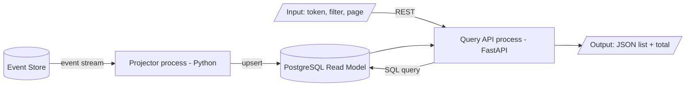

- **Input:** token, filter và phân trang.
- **Xử lý:** kiểm quyền/tham số → query Read Model → tạo DTO.
- **Output:** danh sách, tổng số dòng và thông tin phân trang.
- **Bản in:** giao diện danh sách.

---

## Câu 16 — Event Sourcing: lưu trữ và tái tạo trạng thái

### Đề bài rút gọn

- Vẽ **storage view**.
- Liệt kê công cụ dùng để cài đặt thiết kế lưu trữ.
- Trình bày các bước cài đặt thiết kế lưu trữ.
- Vẽ luồng dữ liệu từ trạng thái ban đầu đến trạng thái cuối cùng.
- Giải thích cách tái tạo trạng thái hiện tại từ các event đã lưu.
- Liệt kê công cụ dùng để tái tạo trạng thái.
- Trình bày các bước tái tạo trạng thái.

### Đáp án cốt lõi

- **Core:** Event Store là nguồn sự thật; Read Model là dữ liệu được tạo lại từ events.
- **Storage view:** Event gồm `event_id`, `aggregate_id`, `version`, `type`, `payload`, `time`; Checkpoint lưu vị trí projector; Read Model lưu trạng thái hiện tại.
- **Công cụ/cài đặt:** EventStoreDB/PostgreSQL + migration; tạo event table/constraint → checkpoint/read tables → projector.
- **Luồng trạng thái:** `0 --Deposited(100)→ 100 --Withdrawn(30)→ 70`.
- **Tái tạo:** bắt đầu state rỗng/snapshot → đọc events đúng version → áp dụng tuần tự → nhận state cuối.
- **Rebuild Read Model:** tạo bảng mới → replay toàn bộ → so count/state → chuyển Query API sang bảng mới.
- **Công cụ tái tạo:** Event Store client, projector/rebuild script và DB viewer.
- **Bản in:** đề không ghi yêu cầu nộp kèm riêng cho câu 16.

---

# Topic 5 — Event-Driven Architecture (câu 17–20)

**Lý thuyết chung:** producer phát event, broker trung chuyển, consumer xử lý. Hệ thống giảm coupling nhưng phải xử lý duplicate, retry, DLQ và eventual consistency.

## Câu 17 — Event-Driven: chất lượng và logic

### Đề bài rút gọn

- Liệt kê các đặc tính chất lượng mong muốn đạt được.
- Giải thích cách kiểm tra từng đặc tính.
- Vẽ **logic view**.
- Ghi công cụ cài đặt từng thành phần trên sơ đồ.
- **Nộp kèm:** giao diện nhập dữ liệu và cây thư mục mã nguồn.

### Đáp án cốt lõi

- **Core:** producer phát event; broker chuyển/giữ event; consumer độc lập xử lý.
- **Khi dùng:** nhiều thành phần cần phản ứng bất đồng bộ với cùng sự kiện và cần tách producer khỏi consumer.
- **Trade-offs:** loose coupling, scale và chịu lỗi tốt, nhưng phải xử lý eventual consistency, duplicate/thứ tự event và debug luồng phân tán.
- **Loose coupling — Công cụ:** Git/contract test; **cách đo:** thêm consumer mà producer không đổi.
- **Scalability — Công cụ:** Locust + Kafka/Grafana; **cách đo:** events/giây và lag trước/sau khi tăng partition/consumer.
- **Availability — Công cụ:** Docker/Kafka UI; **cách đo:** tắt consumer rồi bật lại, event tồn đọng vẫn được xử lý.
- **Reliability — Công cụ:** retry/DLQ dashboard; **cách đo:** lỗi tạm thời được retry, lỗi lâu vào DLQ.
- **Idempotency — Công cụ:** pytest/DB query; **cách đo:** cùng `event_id` hai lần nhưng kết quả chỉ đổi một lần.
- **Logic view:** `Producer API → Kafka → [Consumer A | Consumer B] → Databases`.
- **Công cụ cài đặt:** FastAPI, Kafka/RabbitMQ, Python consumer và PostgreSQL.
- **Bản in đúng theo đề:** giao diện nhập dữ liệu và cây thư mục mã nguồn.

---

## Câu 18 — Event-Driven: triển khai

### Đề bài rút gọn

- Vẽ **deployment view**.
- Ghi công cụ triển khai từng thành phần trên sơ đồ.
- Trình bày các bước triển khai hệ thống.
- **Nộp kèm:** câu lệnh hoặc giao diện công cụ trực tuyến dùng để triển khai.

### Đáp án cốt lõi

- **Core:** broker và mỗi producer/consumer chạy thành process/container riêng.
- **Deployment view:** `Client --HTTPS→ Producer API container --SQL→ PostgreSQL/Outbox --event→ Kafka → Consumer containers --SQL→ Databases`.
- **Công cụ:** Docker/Kubernetes, PostgreSQL, Kafka/RabbitMQ và Grafana.
- **Các bước:** deploy broker/topic → deploy DB/consumers → deploy producer → gửi event test → kiểm tra kết quả/lag → scale consumer nếu cần.
- **Bản in đúng theo đề:** một số câu lệnh cần thiết **hoặc** giao diện công cụ trực tuyến dùng để triển khai.

---

## Câu 19 — Event-Driven: tiến trình nhập dữ liệu

### Đề bài rút gọn

- Chọn một chức năng nhập dữ liệu cụ thể.
- Vẽ **process view** cho chức năng đó.
- Liệt kê và giải thích các công cụ kiểm tra tính hợp lệ của input.
- Trình bày từng bước kiểm tra input.
- Trình bày từng bước ghi dữ liệu khi input hợp lệ.

### Đáp án cốt lõi

- **Core:** chỉ input hợp lệ mới được lưu và tạo event.

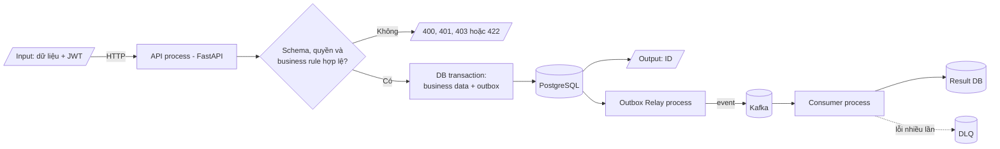

- **Công cụ kiểm tra:** Pydantic/JSON Schema kiểm cấu trúc; JWT middleware kiểm quyền; service/DB constraint kiểm business rule.
- **Input sai:** trả `400/401/403/422`, không lưu.
- **Input đúng:** ghi business data + outbox trong một transaction → commit → trả ID → relay publish event.
- **Consumer:** kiểm schema/duplicate → xử lý → lưu kết quả → lỗi thì retry/DLQ.
- **Bản in:** đề không ghi yêu cầu nộp kèm riêng cho câu 19.

---

## Câu 20 — Event-Driven: logging, tracing và monitoring

### Đề bài rút gọn

- Vẽ **observability view** gồm logging và tracing.
- Ghi công cụ cài đặt từng thành phần giám sát trên sơ đồ.
- Trình bày các bước log event từ lúc phát sinh đến lúc được xử lý.
- Trình bày các bước trace toàn bộ hành trình của event.
- Trình bày cách monitor event và các thành phần xử lý.
- **Nộp kèm:** câu lệnh xem kết quả giám sát và giao diện hiển thị kết quả.

### Đáp án cốt lõi

- **Core:** theo dõi một event từ producer qua broker đến consumer bằng các ID chung.
- **View:** `Producer → Kafka → Consumers → OpenTelemetry Collector → [Loki | Jaeger | Prometheus] → Grafana`.
- **Công cụ:** OpenTelemetry, Loki, Jaeger, Prometheus và Grafana.
- **Các bước:** tạo `event_id/correlation_id` → đặt vào header → log lúc publish/consume/retry/DLQ → tạo spans → thu lag/error/DLQ metrics → hiển thị và cảnh báo.
- **Kiểm tra:** phát một event, tìm toàn bộ log/trace theo correlation ID và xem dashboard lag.
- **Bản in:** lệnh xem log, trace và dashboard.

### Cách chạy demo thật cho câu 20

Demo dùng `Reservation Service → Redpanda (Kafka-compatible) → Notification Consumer`. `traceparent` đi trong event header; `eventId` đi trong payload và log.

```bash
cd observability-demo
docker compose up --build -d
curl -X POST http://localhost:8081/book \
  -H 'Content-Type: application/json' \
  -d '{"hotelId":"hotel-01","userId":"user-01"}'
docker compose logs --no-log-prefix gateway reservation consumer
docker compose ps
```

- Jaeger: `http://localhost:16686` → trace có đủ `POST /book → reservation.create → notification.handle`.
- Dữ liệu event thô: `http://localhost:8080/topics/reservation-events`.
- Bản in: các lệnh trên, ảnh Jaeger và ảnh topic chứa event thô. Tìm cùng một `eventId` trong producer/consumer logs để giải thích correlation.

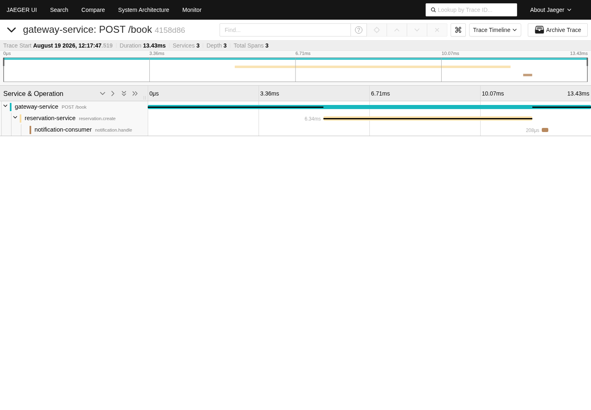

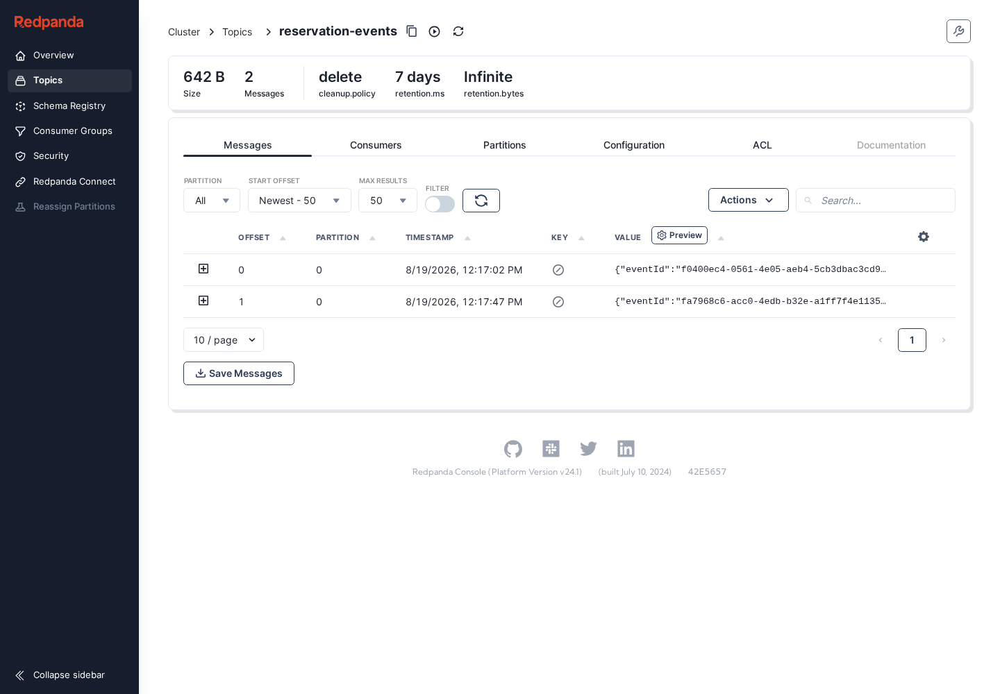

---

# Topic 6 — Kappa Architecture (câu 21–22)

**Lý thuyết chung:** event được giữ trong Kafka log; stream processor xử lý liên tục và ghi kết quả vào Serving DB. Khi cần tính lại, replay log qua processor.

## Câu 21 — Lambda hoặc Kappa: chất lượng và logic

### Đề bài rút gọn

- Chọn **một** kiến trúc: Lambda hoặc Kappa.
- Liệt kê các đặc tính chất lượng mong muốn đạt được.
- Liệt kê công cụ dùng để kiểm tra các đặc tính đó.
- Trình bày các bước kiểm tra.
- Vẽ **logic view** của kiến trúc đã chọn.
- Ghi công cụ cài đặt từng thành phần trên sơ đồ.
- **Nộp kèm:** giao diện nhập dữ liệu và cây thư mục mã nguồn.

### Đáp án cốt lõi

- **Core:** Kappa dùng một stream pipeline; muốn tính lại thì replay event log.

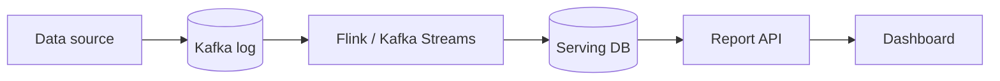

| Chất lượng | Công cụ và cách đo |
|---|---|
| Near real time | Kafka/Flink metrics: event-to-report latency và lag |
| Scalability | Locust + Kafka/Flink: events/giây trước/sau khi tăng partition/parallelism |
| Fault tolerance | Checkpoint + Docker/Kubernetes: restart mà không mất/trùng kết quả |
| Replay/recovery | Consumer group mới + SQL: replay vào DB mới, `count/sum` đúng |
| Correctness | Tập event chuẩn: aggregate đúng với duplicate/out-of-order |

- **Bản in đúng theo đề:** giao diện nhập dữ liệu và cây thư mục mã nguồn.

---

## Câu 22 — Lambda hoặc Kappa: tiến trình xuất báo cáo

### Đề bài rút gọn

- Sử dụng cùng kiến trúc Lambda hoặc Kappa đã chọn.
- Chọn một chức năng xuất báo cáo thống kê cụ thể.
- Vẽ **process view** cho chức năng đó.
- Thể hiện rõ input, các bước xử lý và output của báo cáo.
- **Nộp kèm:** giao diện báo cáo và giao diện hiển thị dữ liệu thô của báo cáo.

### Đáp án cốt lõi

- **Core:** stream processor tính sẵn số liệu; Report API chỉ đọc Serving DB.

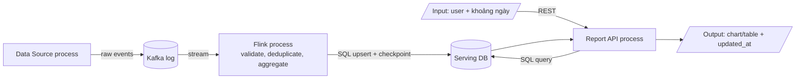

- **Input:** event dữ liệu; yêu cầu báo cáo gồm user và khoảng ngày.
- **Xử lý:** validate/deduplicate → tính tổng theo ngày → lưu aggregate/checkpoint → API kiểm quyền và query.
- **Output:** bảng/biểu đồ và thời điểm cập nhật cuối.
- **Khôi phục:** processor chạy lại từ checkpoint; đổi công thức thì replay vào bảng mới.
- **Bản in:** giao diện báo cáo và dữ liệu thô tương ứng.

---

## Checklist trước khi thi

- Khái niệm có WHAT → HOW → WHY → WHEN và trade-offs.
- Logic view có trách nhiệm → quan hệ → công nghệ/ngôn ngữ.
- Deployment view có node → artifact/module → giao thức.
- Process view có runtime processes → input/biến đổi/output → IPC/giao thức → công nghệ.
- Mỗi đặc tính chất lượng có công cụ → cách kiểm tra → metric.
- Chỉ nói điều đã thực hành và chuẩn bị đúng bản in liên quan.
