# Bộ bản in nộp kèm — 22 câu

File này chỉ dùng để chuẩn bị **bản in**, không phải đáp án học thuộc. In từ trước, ghi số câu thật lớn trên từng tập. Trong 10 phút viết A4 không được xem; sau đó có 2 phút chọn tập liên quan.

## Trạng thái

- **Đã có giao diện/cây source thật:** câu 4, 6, 8, 9, 11, 13, 15, 17, 20, 21 và 22.
- **Trang câu lệnh:** câu 1, 2, 3, 5, 7, 10, 12, 14 và 18.
- **Đề không yêu cầu bản in riêng:** câu 16 và 19.
- Các UI trong file được tạo từ hai demo chạy được: `observability-demo` và `print-artifacts-demo`.

---

## Câu 1 — Kiểm tra chất lượng và triển khai Microservices

```bash
docker compose up --build -d
docker compose ps
curl http://localhost:8081/availability
# Ví dụ công cụ tạo tải; đề không bắt buộc in kết quả load test
wrk -t2 -c20 -d30s http://localhost:8081/availability
```

Nộp trang lệnh này và, nếu có, một ảnh giao diện/cửa sổ terminal của công cụ kiểm tra.

## Câu 2 — Cài đặt mã nguồn Microservices

```bash
git clone https://github.com/khuongduy354/onthi-swe.git
cd onthi-swe/observability-demo
docker compose build gateway reservation
docker compose up -d
docker compose ps
```

## Câu 3 — Thiết lập và thực hiện scaling

```bash
docker compose up -d --scale reservation=3
docker compose ps
# Hoặc Kubernetes:
kubectl scale deployment reservation --replicas=3
kubectl get pods
```

## Câu 4 — Logging và tracing Microservices

```bash
cd observability-demo
docker compose up --build -d
curl http://localhost:8081/availability
docker compose logs --no-log-prefix gateway reservation
```


Trong ảnh: **2 services, 2 spans** — `gateway-service: GET /availability` gọi `reservation-service: availability.check`.

## Câu 5 — Cài đặt component/service mới

```bash
cd observability-demo
docker compose build consumer
docker compose up -d consumer
docker compose ps consumer
docker compose logs consumer
```

## Câu 6 — Micro-Frontends

Hai Micro-Frontend chạy riêng:

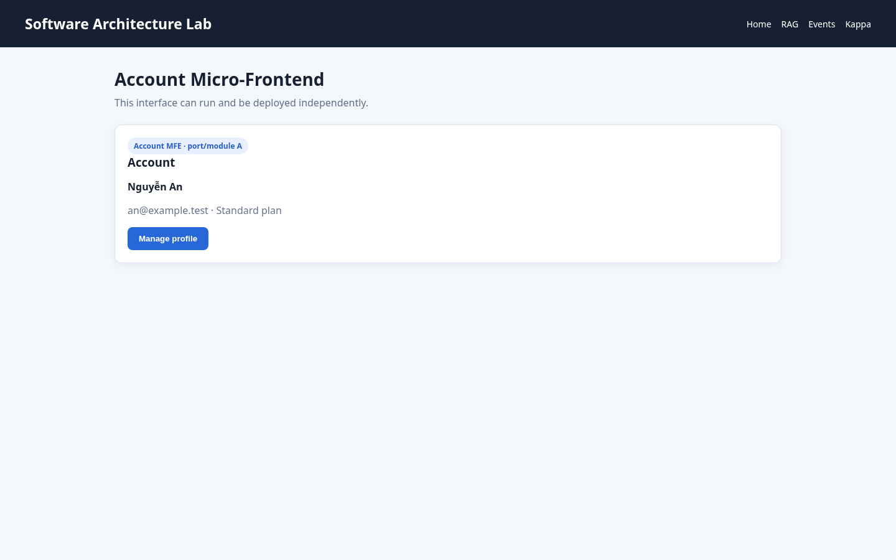

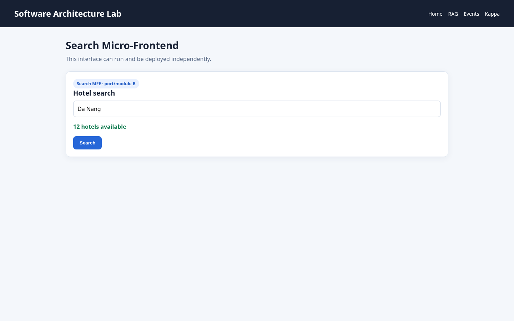

App Shell tải và ghép ba UI fragment lúc runtime:

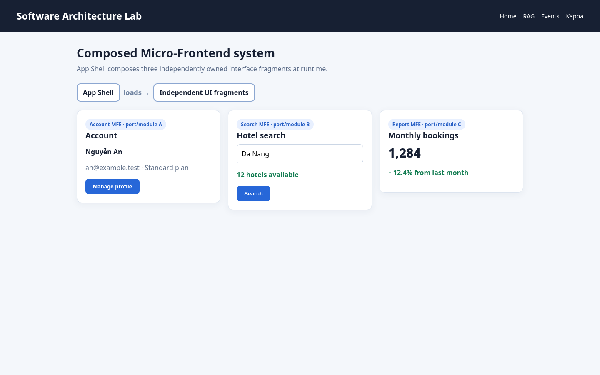

Cấu trúc thể hiện Shell, các remote độc lập và phần dùng chung:

```text
microfrontends/
├── app-shell/
│   ├── remote-manifest.json
│   └── shell.js
├── remotes/
│   ├── account/index.html
│   ├── search/index.html
│   └── report/index.html
└── shared/
    └── design-tokens.css
```

## Câu 7 — Triển khai Micro-Frontends

```bash
npm ci
npm test
npm run build
npx vercel --prod
```

## Câu 8 — JAMstack

Giao diện JAMstack được render từ file có sẵn trong `dist/`:

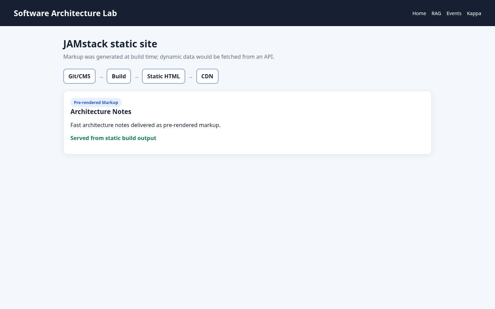

Cây mã nguồn thật:

```text
jamstack/
├── src/
│   ├── content/site.json
│   └── pages/index.html
├── scripts/build.py
└── dist/index.html
```

## Câu 9 — RAG

Giao diện hỏi–đáp, top-2 chunks và citation:

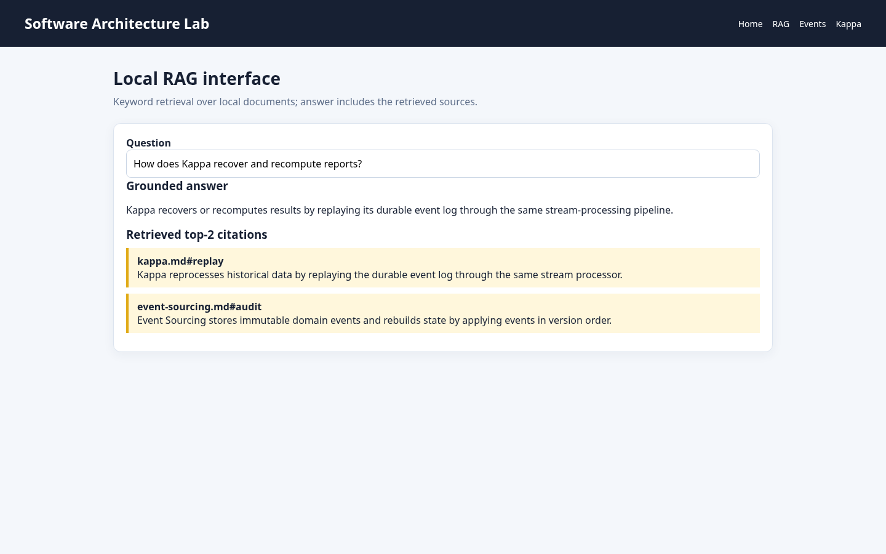

Cây mã nguồn thật:

```text
rag/
├── data/
│   └── documents.py
├── ingestion/
│   ├── chunker.py
│   ├── embedder.py
│   └── indexer.py
├── infrastructure/
│   └── vector_store.py
├── retrieval/
│   ├── tokenizer.py
│   └── retriever.py
└── generation/
    ├── prompt_builder.py
    └── answer_service.py
```

Demo offline dùng embedding/retrieval xác định và answer mẫu có citation; `answer_service.py` là boundary để thay bằng LLM API khi có model/key.

## Câu 10 — Triển khai RAG

Chọn **một** trong hai: trang lệnh dưới đây hoặc ảnh giao diện công cụ triển khai.

```bash
cd print-artifacts-demo
docker build -t rag-demo .
docker run -d --name rag-demo -p 8090:8090 rag-demo
curl http://localhost:8090/rag
```

## Câu 11 — LLM-based Agent

Giao diện task, tool calls, tool results và final answer:

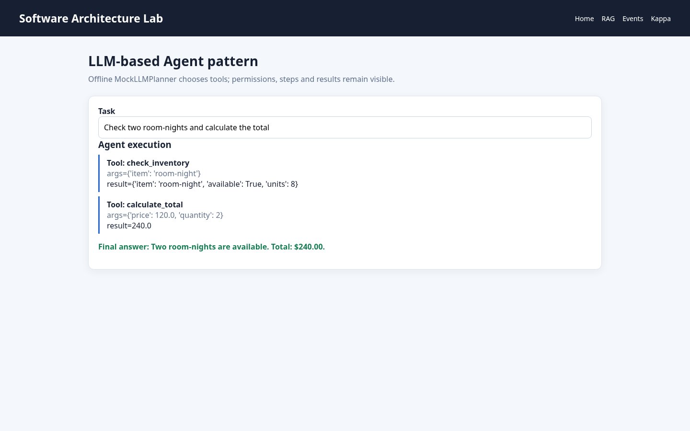

Cây mã nguồn thật:

```text
agent/
├── models/
│   ├── mock_llm.py       # planner offline
│   └── ollama_client.py  # adapter cho model thật
├── core/
│   ├── state.py          # task, max_steps, steps, answer
│   └── executor.py       # agent loop
├── tools/
│   ├── inventory.py
│   ├── pricing.py
│   └── registry.py       # tool name → function
├── memory/
│   └── checkpoint_store.py
└── policies/
    └── permissions.py    # allow/deny tool call
```

Lưu ý trung thực: demo offline dùng `MockLLMPlanner`; tools và agent loop chạy thật. Khi có API key/model local, thay planner bằng LLM mà không đổi tool contracts.

## Câu 12 — Triển khai LLM-based Agent

Chọn **một** trong hai: trang lệnh dưới đây hoặc ảnh giao diện công cụ triển khai.

```bash
cd print-artifacts-demo
docker build -t agent-demo .
docker run -d --name agent-demo -p 8090:8090 agent-demo
curl http://localhost:8090/agent
```

## Câu 13 — Event Sourcing

Giao diện nhập command `StudentAdded`; hệ thống append event và projector tạo Read Model:

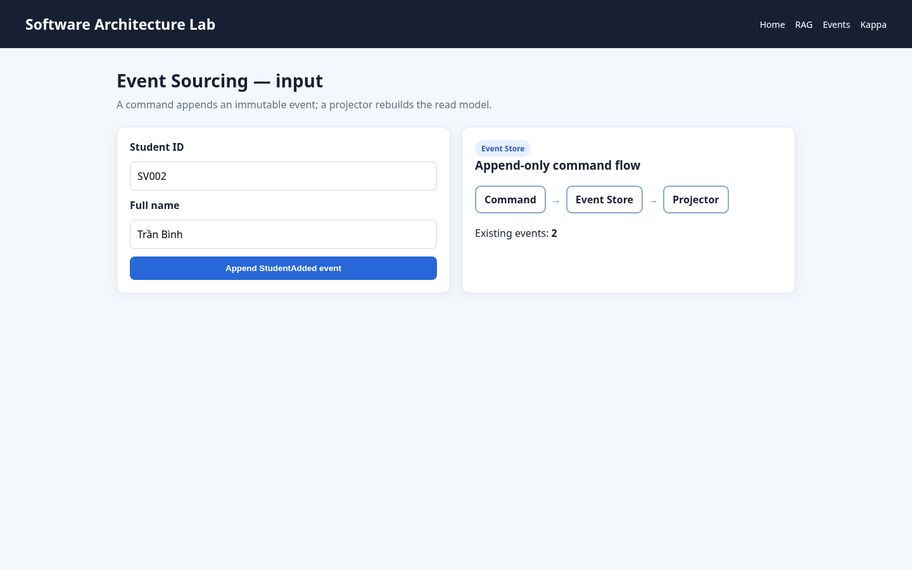

Cây mã nguồn thật:

```text
event_sourcing/
├── domain/
│   ├── events.py
│   └── student.py        # apply event vào aggregate state
├── application/
│   ├── command_service.py
│   └── query_service.py
├── infrastructure/
│   └── event_store.py    # append/read immutable events
└── projections/
    └── student_projector.py
```

## Câu 14 — Triển khai Event Sourcing

Chọn **một** trong hai: trang lệnh dưới đây hoặc ảnh giao diện công cụ triển khai.

```bash
cd print-artifacts-demo
docker build -t event-sourcing-demo .
docker run -d --name event-sourcing-demo -p 8090:8090 event-sourcing-demo
curl http://localhost:8090/event-sourcing/list
```

## Câu 15 — Danh sách Event Sourcing

Danh sách được đọc qua `query_service → project_students()`, không replay trực tiếp trong giao diện:

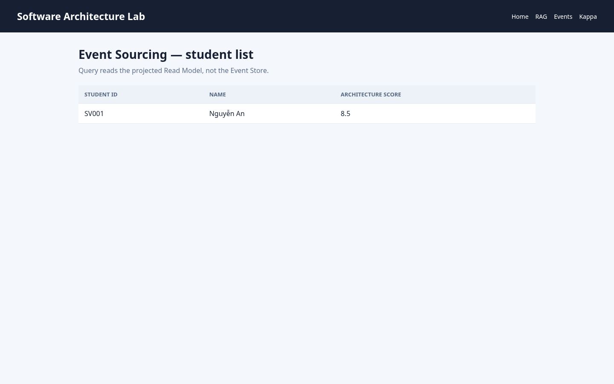

## Câu 16 — Lưu trữ và replay Event Sourcing

Đề không ghi yêu cầu nộp kèm bản in riêng.

## Câu 17 — Event-Driven

Giao diện publish `ReservationCreated`, kèm `eventId`, consumer và kết quả xử lý:

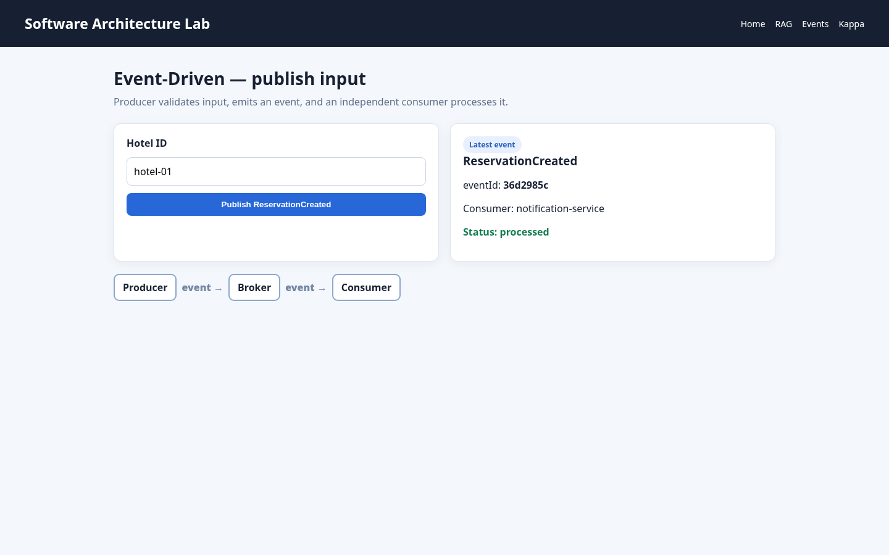

Cây mã nguồn thật:

```text
event_driven/
├── contracts/
│   └── events.py         # ReservationCreated schema
├── producers/
│   └── reservation.py
├── infrastructure/
│   ├── in_memory_broker.py
│   └── dead_letter_queue.py
└── consumers/
    └── notification.py   # idempotent handler
```

## Câu 18 — Triển khai Event-Driven

Chọn **một** trong hai: trang lệnh dưới đây hoặc ảnh giao diện công cụ triển khai.

```bash
cd print-artifacts-demo
docker build -t event-driven-demo .
docker run -d --name event-driven-demo -p 8090:8090 event-driven-demo
curl http://localhost:8090/event-driven/input
```

## Câu 19 — Nhập dữ liệu Event-Driven

Đề không ghi yêu cầu nộp kèm bản in riêng.

## Câu 20 — Observability Event-Driven

```bash
cd observability-demo
docker compose up --build -d
curl -X POST http://localhost:8081/book \
  -H 'Content-Type: application/json' \
  -d '{"hotelId":"hotel-01","userId":"user-01"}'
docker compose logs --no-log-prefix gateway reservation consumer
docker compose ps
```


Trong ảnh: **3 services, 3 spans** — `POST /book → reservation.create → notification.handle`.


Trong ảnh: topic `reservation-events`, partition/offset và JSON có `eventId`.

## Câu 21 — Kappa

Giao diện thêm event vào durable stream:


Cây mã nguồn thật:

```text
kappa/
├── producer/
│   └── input_service.py
├── storage/
│   ├── checkpoint_store.py
│   ├── event_log.py      # durable raw events + replay
│   └── serving_db.py     # materialized report rows
├── stream/
│   └── processor.py      # validate/deduplicate/aggregate
└── api/
    └── report_service.py
```

## Câu 22 — Báo cáo Kappa

Giao diện báo cáo được tính từ stream events:

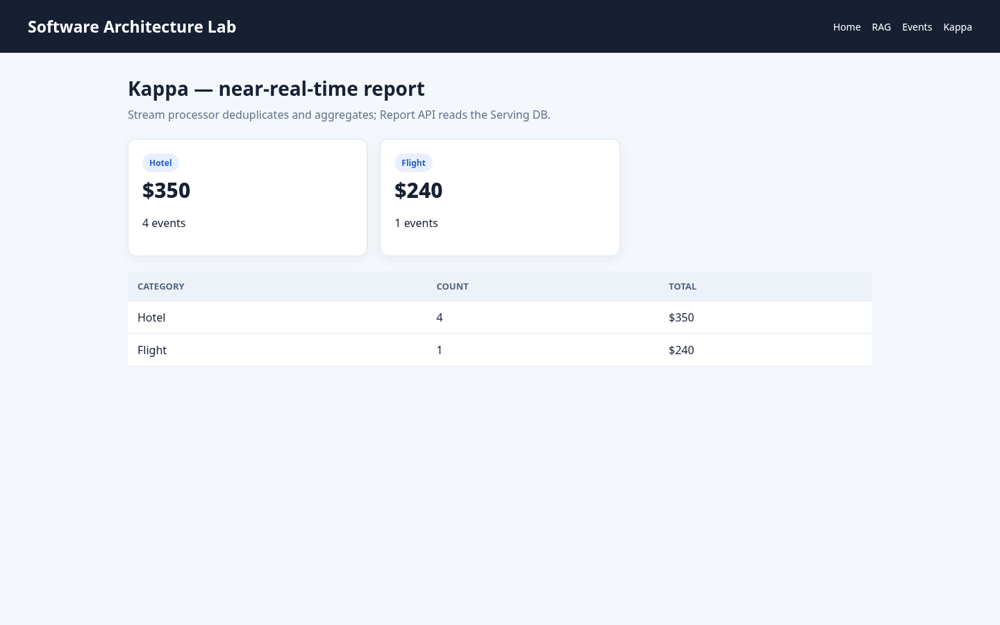

Dữ liệu thô tạo ra đúng count và total trong báo cáo:

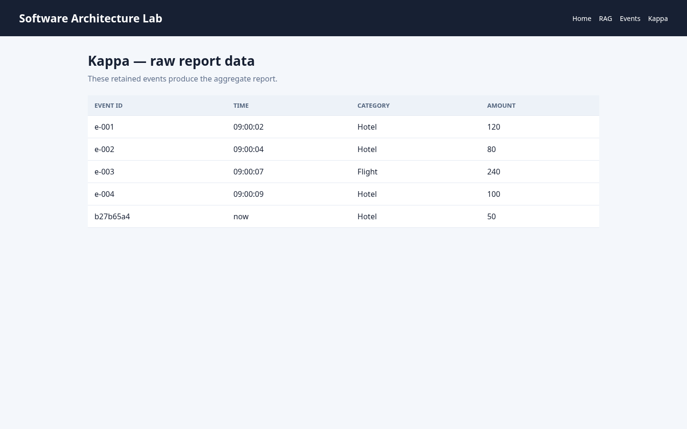
